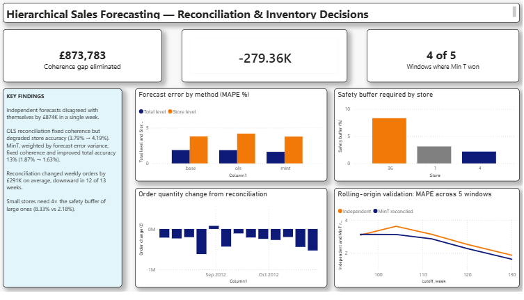

# Hierarchical Sales Forecasting with Inventory Decision Layer

Forecasting 49 sales series across a three-level retail hierarchy, reconciling them to be mutually consistent, and converting the result into order quantities.

## Problem

A retailer forecasts at multiple levels: head office plans against company totals, store managers plan against their own store. Fitting each series independently produces forecasts that contradict each other — the store forecasts do not sum to the company forecast. Both numbers are defensible in isolation; together they mean somebody is planning against a business that does not exist.

## Dataset

Walmart Recruiting — Store Sales Forecasting (Kaggle). 421,570 rows, weekly sales by store and department, February 2010 – October 2012.

Departments were aggregated away, leaving 45 stores × 143 weeks with no missing weeks. Hierarchy: Total → Store Type (A/B/C) → Store. **49 series.** Actual data is coherent by construction — summing the three type series reproduces the total to 7.45e-09.

Raw CSVs are excluded from this repository for size; download from the Kaggle competition page.

## Why the type level exists

Types A and B show a pronounced Christmas peak; Type C does not. The three formats have different seasonal profiles, so modelling them together would smear a pattern that applies to only part of the business. The middle level is data-driven, not structural convenience.

## Method

**Validation split.** Last 13 weeks held out by date, not randomly — random splitting would let the model train on weeks that come after weeks it is tested on.

**Baseline.** Seasonal naive (same week last year). MAPE 2.04% total, 2.92% type, 5.36% store. Error doubles down the hierarchy as store-level noise stops cancelling.

The baseline is **coherent by construction**: it copies historical actuals, which already sum correctly. This establishes that incoherence comes from independently fitting models, not from the hierarchy itself.

**Base models.** SARIMA(1,1,1)(1,1,1,52) fitted independently to all 49 series. Total MAPE 1.87%.

**The incoherence.** The direct total forecast and the sum of the 45 store forecasts disagreed by up to **£873,783** in a single week. Gaps were predominantly positive — a systematic bias, not noise.

**Reconciliation.** A coherent forecast is one expressible as `S × (45 store values)`, where `S` is the 49×45 summing matrix. Reconciliation projects the incoherent forecast onto that subspace.

*OLS:* `P = S(SᵀS)⁻¹Sᵀ`. Verified idempotent, symmetric, trace 45 — confirming projection onto a 45-dimensional subspace, matching the hierarchy's degrees of freedom.

*MinT:* `P = S(SᵀW⁻¹S)⁻¹SᵀW⁻¹`, with W the diagonal forecast-error covariance from in-sample residuals. Still idempotent with trace 45, but **not symmetric** — an oblique projection, orthogonal with respect to the W⁻¹ inner product rather than the Euclidean one. The same OLS-to-GLS distinction.

## Results

| Method | Coherence gap | Total MAPE | Store MAPE |
|---|---|---|---|
| Independent SARIMA | £873,783 | 1.87% | 3.79% |
| OLS reconciled | £0 | 1.86% | 4.19% |
| **MinT reconciled** | **£0** | **1.63%** | **3.77%** |

**OLS buys coherence at the cost of store accuracy.** It assumes all 49 series are equally reliable — an assumption already contradicted by the baseline, where store MAPE was 2.6× total MAPE. Noisy store errors are permitted to pull on well-estimated aggregates.

**MinT buys coherence for free**, improving total-level accuracy by 13%. Reconciliation lets disaggregated information flow upward; weighted by reliability it carries signal, weighted equally it carries noise. **The weighting is what makes reconciliation work, not the reconciliation itself.**

## Validation

**Rolling-origin cross-validation** across five cutoffs (weeks 96, 104, 112, 120, 130):

| Cutoff | Base | MinT |
|---|---|---|
| 96 | 3.10% | 3.14% |
| 104 | 3.63% | 3.13% |
| 112 | 3.15% | 2.87% |
| 120 | 2.53% | 2.28% |
| 130 | 1.87% | 1.63% |

MinT wins **4 of 5 windows**, mean improvement 0.246pp. The single loss is at the shortest training window, where W is least reliably estimated — the advantage appears conditional on having enough history to estimate the error covariance.

## Decision layer

A forecast is not an instruction. Ordering the point forecast means stocking out roughly half the time, which is optimal only when understocking and overstocking cost the same.

The newsvendor solution orders at the **critical fractile** `Cu/(Cu+Co)`:

| Scenario | Fractile | Order vs forecast |
|---|---|---|
| Fresh grocery (Cu=1, Co=3) | 0.25 | −£1.43M |
| Balanced (Cu=1, Co=1) | 0.50 | £0 |
| General merchandise (Cu=3, Co=1) | 0.75 | +£1.43M |
| Critical stock (Cu=9, Co=1) | 0.90 | +£2.72M |

Same forecast, four different correct decisions.

**Reconciliation changes the decision.** Rebuilding order quantities on MinT forecasts shifts the weekly order by **−£279K on average**, negative in 12 of 13 weeks — the unreconciled forecasts were systematically high, so reconciliation reduces over-ordering.

**Store-level buffers vary substantially.** Store 36 requires an 8.33% safety buffer against store 4's 2.18%: smaller stores carry proportionally more forecast noise. A flat percentage rule would under-protect small stores and over-protect large ones simultaneously.

**Normality does not hold.** Residuals show skew 0.311, kurtosis 1.983, Jarque-Bera p = 0.011. The empirical 75th percentile (£380,811) is 3.6× smaller than the normal-implied value (£1,364,800) — a £1.05M weekly difference in order quantity. Fat tails inflate the standard deviation, and the normal assumption spreads that inflation symmetrically into a right tail the data does not exhibit.

## Limitations

**Test window excludes Christmas.** Held-out weeks run August–October 2012. The annual peak is never evaluated; reported MAPEs understate holiday-period difficulty.

**SARIMA parameters not tuned.** All 49 series use (1,1,1)(1,1,1,52). Individual stores likely warrant different orders; 49 grid searches was outside scope. The comparison across reconciliation methods remains valid since all three share identical base forecasts.

**Two and a half seasonal cycles.** 130 training weeks against a 52-week period — thin for estimating annual seasonality, and the reason `enforce_stationarity` and `enforce_invertibility` were disabled.

**Residual burn-in was initially wrong.** W was first estimated from index 52 (the seasonal period). Diagnostics showed the Kalman filter had not converged: residual standard deviation was £8.3M at index 52 versus £2.0M at index 80, the latter matching SARIMA's reported forecast standard error of £2.1M. Re-estimating from index 80 changed total MAPE from 1.57% to 1.63%. The MinT conclusion held, but the original figure was contaminated; all results above use burn-in 80.

**Empirical quantiles are noisier.** The empirical 75th percentile is less biased than the normal-implied one but estimated from 50 residuals — thin for a tail quantile. This is a bias-variance tradeoff, not a clean improvement.

**Persistent negative residual mean.** −£707K on a ~£47M series, roughly 1.5% systematic over-prediction in sample. Not diagnosed further.

**Prediction intervals not reconciled.** Order quantities use standard errors from the unreconciled fit. Propagating the full covariance through reconciliation is outside scope, so buffer widths are approximate even where point forecasts are reconciled.

## Dashboard



Power BI report: method comparison, rolling-origin validation, order impact, and store-level buffer requirements.

## Project Structure

```
sales_forecasting/
├── data/
│   ├── base_forecasts.csv
│   ├── reconciled_mint_burn80.csv
│   ├── final_comparison.csv
│   ├── rolling_origin_cv.csv
│   ├── order_comparison.csv
│   └── store_orders.csv
├── images/
│   └── dashboard.png
├── notebooks/
│   ├── 1_eda.ipynb
│   └── 2_forecasting.ipynb
├── forecasting_dashboard.pbix
├── .gitignore
└── README.md
```

## Tools

Python (pandas, numpy, statsmodels, scipy, matplotlib) · Power BI